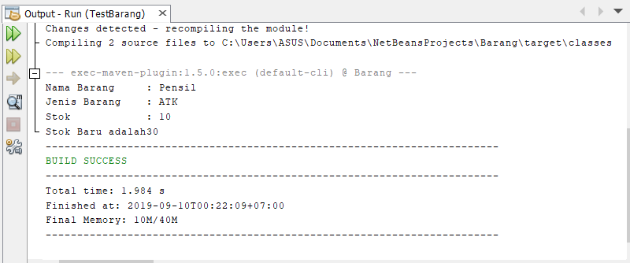

# Laporan Praktikum #2 - Pengantar Konsep PBO

## Kompetensi

 Mahasiswa dapat memahami deskripsi dari class dan object 

 Mahasiswa memahami implementasi dari class 

 Mahasiswa dapat memahami implementasi dari attribute 

 Mahasiswa dapat memahami implementasi dari method 

 Mahasiswa dapat memahami implementasi dari proses instansiasi

 Mahasiswa dapat memahami implementasi dari try-catch 

 Mahasiswa dapat memahami proses pemodelan class diagram menggunakan UML 

## Ringkasan Materi

Class dan Object
 Pada pertemuan sebelumnya anda sudah diberikan banyak penjelasan secara semantic (makna) mengenai deskripsi dari class dan object. Secara singkat class adalah abstraksi dari sebuah object (nyata ataupun tdk nyata) (roger s pressman). Apabila kita ingin membuat class mahasiswa, maka kita perlu melakukan abstraksi (mengindikasi bagian – bagian penting yang merepresentasikan benda itu sendiri) dari object mahasiswa itu sendiri. Contoh salah satu attribute yang mengidentifikasi jika seseorang itu mahasiswa adalah Nim (Nomor Induk Mahasiswa), dan Nim tidak akan anda temui pada attribute dosen. Selain attribute abstraksi juga digunakan untuk behavior (perilaku) , contoh salah satu perilaku yang bisa dilakukan oleh mahasiswa adalah mengikuti UAS, dan anda juga tidak akan pernah menemui perilaku tersebut pada object dosen. Oleh karena itu sangat mudah untuk seorang perancang system dalam memodelkan sebuah class dari sebuah object tertentu.  Setelah kita memahami secara semantic pengertian dari class dan object, maka langkah selanjutnya adalah bagaimana cara melakukan implementasi class pada pendekatan Object Oriented Programming, terutama pada bahasa pemrograman java. Berikut adalah sintaks dari deklarasi class pada pemrograman java : 

 

## Percobaan

### Percobaan 1
pada percobaan ini, membuat sebuah class diagram dimana ada sebuah data karyawan dimana tiap karyawan memiliki id,nama,jenis kelamin,jabatan,dan gaji. Dan dapat menampilkan data diri pribadi dan melihat gajinya.
#### class Diagram

2. Sebutkan Class apa saja yang bisa dibuat dari studi kasus 1!

jawab :
Class Karyawan.java dan Class KaryawanMain.java

3. Sebutkan atribut beserta tipe datanya yang dapat diidentifikasi dari masing-masing class dari studi kasus 1! 

jawab :
- id: Int 
- Nama: String 
- Jenis kelamin: String
- Jabatan: String 
- Gaji: Int

4. Sebutkan method-method yang sudah anda buat dari masing-masing class pada studi kasus 1! 

jawab :
Public void tampilData().

### Percobaan 2

Pada percobaan tersebut, membuat sebuah program berdasarkan class diagram , yaitu class diagram Mahasiswa

#### Class Mahasiswa1841720007BINTANG

Contoh link kode program : [Mahasiswa1841720007BINTANG](../../src/2_Class_dan_Object/Mahasiswa1841720007BINTANG.java)

#### Class TestMahasiswa1841720007BINTANG

Setelah membuat program class Mahasiswa, selanjutnya membuat class main, yaitu sebuah instance dari class Mahasiswa.

Contoh link kode program : [TestMahasiswa1841720007BINTANG](../../src/2_Class_dan_Object/TestMahasiswa1841720007BINTANG.java)

#### HASIL

7. Jelaskan pada bagian mana proses pendeklarasian atribut pada program diatas!

jawab :
Pada clas mahasiswa dari  line 2 sampai dengan line 5

8. Jelaskan pada bagian mana proses pendeklarasian method pada program diatas! 

jawab :
pada class mahasiswa pada line ke 7

9. Berapa banyak objek yang di instansiasi pada program diatas! 

jawab :
satu ,  pada class  testMahasiswa

10. Apakah yang sebenarnya dilakukan pada sintaks program “mhs1.nim=101” ? 

jawab:
menampilkan pada objek

11. Apakah yang sebenarnya dilakukan pada sintaks program “mhs1.tampilBiodata()” 

jawab :
untuk  menampilkan output yang

12. Instansiasi 2 objek lagi pada program diatas! 

jawab :

### Percobaan 3

Pada percobaan ini mahasiswa diharapkan membuat pemrograman dengan Class Barang dimana pada pemrograman tersebut memiliki argument/parameter dan memiliki return.

#### Class Barang1841720007BINTANG

Contoh link kode program : [Barang1841720007BINTANG](../../src/2_Class_dan_Object/Barang1841720007BINTANG.java)

#### Class TestBarang1841720007BINTANG

Contoh link kode program : [TestBarang1841720007BINTANG](../../src/2_Class_dan_Object/TestBarang1841720007BINTANG.java)

#### HASIL

7. Apakah fungsi argumen dalam suatu method? 

jawab :
Fungsi  yang  memberi nilai bedasarkan suatu method

8. Ambil kesimpulan tentang kegunaan dari kata kunci return , dan kapan suatu method harus memiliki return!

jawab:
Return adalah kata kunci untuk mengembalikan atau mengelluarkan suatu nilai, method  dengan tipe data void , berarti tidaj memerlukan kata kunci return di dalamnya method dengan tipe data bukan void berarti memerlukan kata return

## Tugas

#### 1. Diagram persewaan vidio game

#### 2. Class Penyewaan

Contoh link kode program : [Penyewaan1841720007BINTANG](../../src/2_Class_dan_Object/Penyewaan1841720007BINTANG.java)

##### Class main Penyewaan

Contoh link kode program : [PenyewaanMain1841720007BINTANG](../../src/2_Class_dan_Object/PenyewaanMain1841720007BINTANG.java)

#### HASIL

#### 3. Class Lingkaran

Contoh link kode program : [Lingkaran1841720007BINTANG](../../src/2_Class_dan_Object/Lingkaran1841720007BINTANG.java)

##### Class Main Lingkaran

Contoh link kode program : [LingkaranMain1841720007BINTANG](../../src/2_Class_dan_Object/LingkaranMain1841720007BINTANG.java)

#### HASIL

#### 4. Class Tugas Diskon 

Contoh link kode program : [DISKON1841720007BINTANG](../../src/2_Class_dan_Object/DISKON1841720007BINTANG.java)

##### Class Main Tugas Diskon

Contoh link kode program : [TestDiskon1841720007BINTANG](../../src/2_Class_dan_Object/TestDiskon1841720007BINTANG.java)

#### HASIL

## Kesimpulan

Jadi dari pembelajaran tersebut kita dapat memahami deskripsi class dan object, implementasi dari class tersebut, dan implementasi dari method, proses intansiasi, try-catch.

## Pernyataan Diri

Saya menyatakan isi tugas, kode program, dan laporan praktikum ini dibuat oleh saya sendiri. Saya tidak melakukan plagiasi, kecurangan, menyalin/menggandakan milik orang lain.

Jika saya melakukan plagiasi, kecurangan, atau melanggar hak kekayaan intelektual, saya siap untuk mendapat sanksi atau hukuman sesuai peraturan perundang-undangan yang berlaku.

Ttd,

*(Mohamad Bintang Satriavi)*
